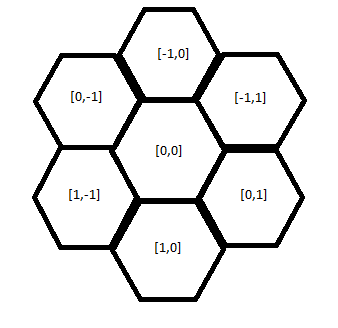
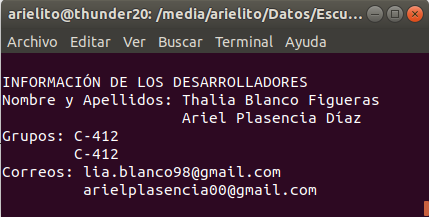
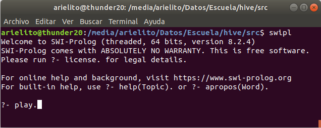

# Hive

## Autores

| **Nombre y Apellidos** | Grupo |         **Correo**         |
| :--------------------: | :---: | :------------------------: |
| Thalia Blanco Figueras | C-412 |   lia.blanco98@gmail.com   |
|  Ariel Plasencia Díaz  | C-412 | arielplasencia00@gmail.com |

## Juego Hive

*Hive* es un juego de estrategia de mesa diseñado y publicado en 2001. El objetivo del juego es capturar a la abeja reina del oponente permitiéndole estar completamente rodeada por otras piezas (pertenecientes a cualquiera de los jugadores), mientras se evita la captura de la propia reina. *Hive* comparte elementos tanto de juegos basados en fichas como de juegos de mesa. Se diferencia de otros juegos basados en fichas en que las fichas, una vez colocadas, se pueden mover a otras posiciones de acuerdo con varias reglas, al igual que las piezas de ajedrez.

## Ideas generales de la implementación

En cuanto a la interfaz visual del juego implementado, esta se lleva a cabo completamente en la consola. En cada turno el correspondiente jugador va a poder poner piezas de las que no están en el tablero (de ser posible) ó mover las que si lo estén (de ser posible); mostrándose siempre en la parte superior de la consola dicho tablero.

Como cada ficha constituye un hexágono, posee seis posibles posiciones a fichas adyacentes. Por ello, para modelar a cada ficha, hacemos uso de unas coordenadas *[Fila, Columna]*, que definen su posición relativa en el tablero; y por tanto, las adyacentes también tienen asociadas sus respectivas coordenadas. Las posiciones adyacentes asociadas a una ficha con coordenada *[F, C]* son:

* *[F - 1, C]* : ubicada al norte de *[F, C]*.
* *[F + 1, C]* : ubicada al sur de *[F, C]*.
* *[F - 1, C + 1]* : ubicada al noreste de *[F, C]*.
* *[F, C - 1]* : ubicada al noroeste de *[F, C]*.
* *[F, C + 1]* : ubicada al sureste de *[F, C]*.
* *[F + 1, C - 1]* : ubicada al suroeste de *[F, C]*.

Si *[F, C] = [0, 0]*, resultaría:



En nuestro juego existen doce fichas para cada jugador (las extendidas mosquito y bicho bola no están consideradas en nuestro juego):

* 1 abeja reina
* 3 hormigas soldado
* 3 saltamontes
* 2 escarabajos
* 2 arañas 
* 1 mariquita

### Diseño y modelación

Sobre la base de los conceptos encontrados durante el análisis del problema, nuestra propuesta de solución agrupa los predicados implementados en los siguientes módulos:

1. **play.pl**: Contiene el predicado inicial del programa, el cual a partir de una entrada válida del usuario, ejecuta la opción deseada (predicado `play/0`).

2. **play_between_players.pl**: Contiene los predicados vinculados con la lógica asociada a una partida entre dos jugadores (predicado `playBetweenTwoPlayers/0`).

3. **play_versus_computer.pl**: Contiene los predicados vinculados con la lógica asociada a una partida  contra la computadora (predicado `playVersusComputer/0`).

4. **record.pl**: Es una estructura (se controla a través de listas) que contiene los predicados relacionados con las fichas de cada jugador.

   * *Token*: Es el tipo de ficha disponible en el juego: abeja reina (queen), hormiga (ant), saltamontes (grasshoper), escarabajo (beetle), araña (spider), mariquita (ladybug).
   * *Row*: Es la fila donde se encuentra la pieza en caso de estar ubicada en el tablero.
   * *Column*: Es la columna donde se encuentra la pieza en caso de estar ubicada en el tablero.
   * *Color*: Representa el color de cada pieza, ya sea blanca (0) o negra (1).
   * *InBoard*: Toma el valor 1 en caso de que la ficha se encuentre en la mano del jugador y, por tanto, no esté en aún en el tablero. Toma el valor 0 en caso contrario. Notar que todas las fichas aparecen inicialmente en la mano del jugador.
   * *StackPos*: Representa un entero equivalente a cuántas fichas hay apiladas en esa fichas. Notar que todas las fichas aparecen inicialmente con valor 0.

   ```perl
   initRecord(Token, Row, Column, Color, InBoard, StackPos, Record) :-
   	append([], [ Token, Row, Column, Color, InBoard, StackPos ], Record).
   ```

5. **player.pl**: Es una estructura (se controla a través de listas) que contiene los predicados relacionados a las fichas de un jugador y los cambios que van experimentando las mismas a lo  largo del juego. Posee como primer parámetro el color del jugador (0 blanco y 1 negro) y como segundo parámetro a la lista de `records` que representan a todas las fichas del jugador (anteriormente mencionadas). Además, proveemos una serie de funcionalidades para acceder y verificar estas características.

   ```perl
   initPlayer(Color, Player) :-
       initRecord(queen,      0, 0, Color, 1, 0, Queen),
       initRecord(ant,        0, 0, Color, 1, 0, Ant1),
       initRecord(ant,        0, 0, Color, 1, 0, Ant2),
       initRecord(ant,        0, 0, Color, 1, 0, Ant3),
       initRecord(grasshoper, 0, 0, Color, 1, 0, Grasshoper1),
       initRecord(grasshoper, 0, 0, Color, 1, 0, Grasshoper2),
       initRecord(grasshoper, 0, 0, Color, 1, 0, Grasshoper3),
       initRecord(beetle,     0, 0, Color, 1, 0, Beetle1),
       initRecord(beetle,     0, 0, Color, 1, 0, Beetle2),
       initRecord(spider,     0, 0, Color, 1, 0, Spider1),
       initRecord(spider,     0, 0, Color, 1, 0, Spider2),
       initRecord(ladybug,    0, 0, Color, 1, 0, Ladybug),
       append([],[Color, Queen, Ant1, Ant2, Ant3, Grasshoper1, Grasshoper2, 
       				Grasshoper3, Beetle1, Beetle2, Spider1, Spider2, 
       					Ladybug], Player).
   ```

6. **hand_play.pl**: En este fichero se encuentran todos los métodos asociados a colocar una ficha en mano de un jugador en el tablero.

7. **cells_play.pl**: En este fichero se encuentran todos los métodos asociados a mover una ficha en el tablero hacia otra posición de las posibles según su tipo.

8. **moves.pl**: En este fichero se encuentran los predicados asociados a los movimientos que pueden realizar cada ficha en el tablero, según su tipo.

## Estrategia

### Tablero

El tablero se construye de manera dinámica imprimiendo cada ficha que se encuentre en el mismo, en un cada momento de la partida, a través del uso de los punteros de consola. Como se conocen las fichas que se encuentran en el tablero, se calcula qué posición en la consola debe ocupar la que se encuentre en la posición más al norte (la que menor valor de columna posea, y si son más de una, la que menor sea su valor de columna),  y como en el tablero todas las fichas se encuentran en la misma componente conexa, se comienzan a recorrer todas las fichas a partir de esa inicial, y se van imprimiendo en el tablero (se realiza un DFS por las fichas y por cada una que se encuentre se va imprimiendo). En el caso en que haya un escarabajo bloqueando a otra ficha, en el tablero solo se va a poder presenciar al escarabajo bloqueador (en el caso en que sean más de uno los escarabajos apilados en una determinada posición, en el tablero se mostrará el ubicado más arriba que es equivalente al último que se movió a dicha posición), esto se debe a que no tiene sentido saber mucho acerca de una ficha que no puede ser movida; pero en el momento en que sea desbloqueada (si es que llegan a desbloquearla en algún momento), esta ficha se volverá a presenciar en el tablero. Para lograr el triunfo de imprimir el tablero, se utilizan órdenes de listas y otros predicados que se emplean `printBoard/2` ubicado en el fichero `printer.pl`, que es el que muestra el tablero en la consola. Para poder visualizar dicho tablero, como emplea las posiciones de la consola, se requiere que se emplee la consola propia de `swipl` ya que en la consola de *Windows* no es compatible con esta forma de moverse dentro de la consola, y es este el único requerimiento.

## Simulación

Cuando iniciamos la simulación del programa nos pide entrar un número que coincide con cuatro opciones. A continuación, profundizaremos en cada una de ellas.

### Partida contra la computadora

En el juego inicialmente se obtienen que opciones puede llevar a cabo el jugador: 

- Mover una ficha: considera el hecho de que su reina tiene que estar ubicada en el el tablero y que alguna de sus piezas pueden ser movidas( ver `canPlayOption2/3`). Los predicados con los que logramos los movimientos de las fichas, se basan fundamentalmente en llamados recursivos para recorrer el tablero (`DFS`), trabajo de listas principalmente los predicados `delete/3`,`subtract/3`, `append/3`, `union/3` e `intersection/3`, ( ver `moves.pl`) ;
- Ubicar una nueva ficha en el tablero: el jugador tiene que tener al menos una ficha en la mano que no haya ubicado aún en el tablero, y de las que se encuentran en el tablero tiene que existir al menos una posición adyacente a las fichas suyas que no sea adyacente a ninguna de las del otro jugador, exceptuando claro el caso inicial (ver `canPlayOption1/3` );
- En caso de que no pueda realizar ninguna de las dos opciones anteriores no podrá jugar en ese turno.

Por ello si el jugador en un determinado momento puede llevar a cabo ambas opciones, se elige de manera aleatoria una a ejecutar; si solo puede ser una de las dos primeras llamamos a la opción posible permitiendo el funcionamiento del ciclo principal; y si no puede jugar (opción 3), entonces no lleva a cabo ninguna acción y se pasa al siguiente jugador; en caso de que este tampoco pueda ni mover ni jugar, no existe ganador y el juego queda en tablas.

 Las piezas a jugar desde la mano de un jugador también se eligen aleatoriamente, aunque, en ocasiones, forzamos a jugar una determinada pieza (por ejemplo la abeja reina tiene que ser jugada antes del movimiento cuatro). Las casillas destino de las fichas a mover se calculan mediante una heurística aleatoria, siempre y cuando no incumplan las reglas del juego.

A continuación, mostramos el ciclo principal de la lógica seguida por nuestro programa.

```perl
loopPlayVersusComputer(FirstPlayer, SecondPlayer, Turn, PlayComputer) :-
	updateTurn(Turn, NewTurn),
	(
        (
            % turno de la inteligencia artificial
            PlayComputer =:= 1,
            computerPlay(FirstPlayer, SecondPlayer, NewFirstPlayer),
            gameOverCheck(NewFirstPlayer, SecondPlayer, Winner1),
            % turno del jugador
            playerPlay(SecondPlayer, NewFirstPlayer, NewSecondPlayer),
            gameOverCheck(NewSecondPlayer, NewFirstPlayer, Winner2)
        );
        (
            % turno del jugador
            playerPlay(FirstPlayer, SecondPlayer, NewFirstPlayer),
            gameOverCheck(NewFirstPlayer, SecondPlayer, Winner1)
            % turno de la inteligencia artificial
            computerPlay(SecondPlayer, NewFirstPlayer, NewSecondPlayer),
            gameOverCheck(NewSecondPlayer, NewFirstPlayer, Winner2)
        )
	),	
	loopPlayVersusComputer(NewFirstPlayer, NewSecondPlayer, NewTurn, PlayComputer).
```

### Partida entre dos jugadores

Este modo de juego lo logramos pulsando 2 como opción al menú principal. Constituye una partida entre dos jugadores humanos interactuando completamente con las opciones de la consola. Sigue la misma lógica anteriormente plasmada en cuanto a los movimientos y posiciones de fichas, lo que las jugadas son llevadas a cabo por los usuarios y no por la computadora.  A continuación, mostramos el ciclo principal de la lógica seguida por nuestro programa.

```perl
loopPlayBetweenPlayers(FirstPlayer, SecondPlayer, Turn) :-
	% turno del primer jugador
	updateTurn(Turn, NewTurn),
	getPossiblePositions(FirstPlayer, SecondPlayer, PositionsFirstPlayer),
	playerPlay(FirstPlayer, SecondPlayer, NewFirstPlayer, PositionsFirstPlayer),
	gameOverCheck(NewFirstPlayer, SecondPlayer, Winner1),
	% turno del segundo jugador
	getPossiblePositions(SecondPlayer, NewFirstPlayer, PositionsSecondPlayer),
	playerPlay(SecondPlayer, NewFirstPlayer, NewSecondPlayer, PositionsSecondPlayer),
	gameOverCheck(NewSecondPlayer, NewFirstPlayer, Winner2),
	loopPlayBetweenPlayers(NewFirstPlayer, NewSecondPlayer, NewTurn).
```

### Tutorial del juego

Constituyen las reglas del juego *Hive* basándonos fundamentalmente en la [orientación](./doc/orientacion.pdf) del proyecto.

### Información de los desarrolladores



## Ejecución

Desde el sistema operativo *Windows* es necesario estar situado sobre la carpeta `src` y ejecutar los siguientes comandos:

```bash
swipl-win.exe
['main.pl'].
play.
```



Lo anterior es debido a que la consola de *Windows* no acepta la manera de imprimir nuestro tablero.

## Casos de prueba

En esta sección enseñaremos algunos casos de ejemplos en nuestro juego para demostrar su correcta implementación. Cabe mencionar que son casos completamente didácticos.

### Caso de prueba # 1

| No. de Movimiento |        Fichas Blancas        |       Fichas Negras        |
| :---------------: | :--------------------------: | :------------------------: |
|         1         |      abeja reina [0, 0]      |    abeja reina [-1, 0]     |
|         2         |      saltamontes [1, 0]      |     mariquita [-1, -1]     |
|         3         |  saltamontes [1, 0] [-2, 0]  | mariquita [-1, -1] [0, -1] |
|         4         |         araña [1, 0]         |    saltamontes [0, -2]     |
|         5         |     araña [1, 0] [-2, 1]     | saltamontes [0, -2] [0, 1] |
|         6         |       hormiga [-3, 0]        |      hormiga [0, -2]       |
|         7         |   hormiga [-3, 0] [-1, 1]    |     escarabajo [1, -2]     |
|         8         |       hormiga [-3, 1]        | escarabajo [1, -2] [0, -1] |
|         9         |     saltamontes [-4, 2]      | escarabajo [0, -1] [1, -1] |
|        10         | saltamontes [-4, 2] [-1, -1] |                            |

Gana el jugador con las piezas blancas en 10 movimientos.

### Caso de prueba # 2

| No.  |       Fichas Blancas       |          Fichas Negras           |
| :--: | :------------------------: | :------------------------------: |
|  1   |     abeja reina [0, 0]     |       abeja reina [-1, 1]        |
|  2   |     escarabajo [1, 0]      |    abeja reina [-1, 1] [0, 1]    |
|  3   |  escarabajo [1, 0] [0, 1]  | no pueden mover ni colocar pieza |
|  4   | escarabajo [0, 1] [-1, 1]  |        escarabajo [0, 2]         |
|  5   |      hormiga [-2, 2]       |           araña [1, 1]           |
|  6   |    saltamontes [-1, 0]     |       araña [1, 1] [0, -1]       |
|  7   | saltamontes [-1, 0] [1, 0] |         hormiga [-1, -1]         |
|  8   |      hormiga [-2, 1]       |     hormiga [-1, -1] [1, -2]     |
|  9   |   hormiga [-2, 1] [1, 1]   |       saltamontes [-1, -1]       |
|  10  |  hormiga [-2, 2] [-1, 2]   |                                  |

Ganan las piezas blancas en 10 movimientos.

## Referencias

1. [Libro de PROLOG](./doc/prolog.pdf)
2. [Orientación del proyecto](./doc/orientacion.pdf)
